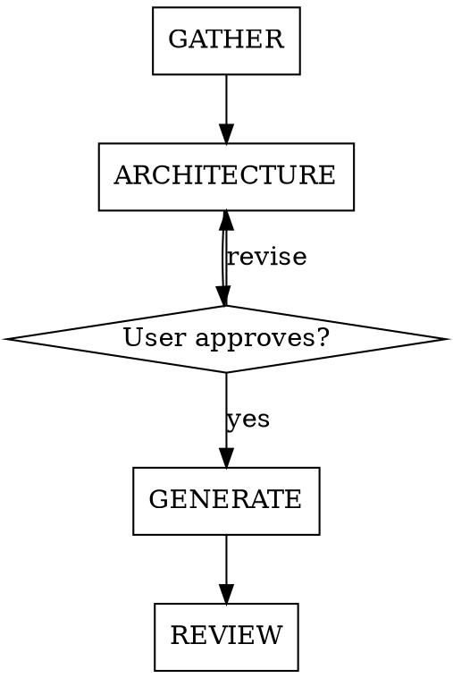

# PLC Ladder Logic Programming

## Overview

Generate production-quality ladder logic (IEC 61131-3 LD) for industrial automation systems from a sequence of operations or P&ID.

**Target audience:** Controls engineers who program PLCs daily.

## Knowledge Context

You have working knowledge of:

- **PLC Engineering:** Scan cycle, I/O mapping, program/task organization, AOIs, UDTs
- **IEC 61131-3 Ladder Diagram:** XIC, XIO, OTE, OTL, OTU, TON, TOF, RTO, CTU, MOV, CMP, GRT, LES, EQU, JSR, RET, NOP
- **Mechanical/Electrical fundamentals:** Motor control circuits, VFDs, control valves (2-way, 3-way), analog instrumentation (4-20mA, RTD), discrete I/O
- **PLC Standards:** IEC 61131-3, ISA-5.1 (instrumentation symbols), ISA-88 (batch), ISA-18.2 (alarm management basics)
- **Common platforms:** Rockwell Studio 5000 / Logix Designer, Siemens TIA Portal, Automation Direct, Schneider, Omron
- **PlantPAx AOIs** (Rockwell): P_AIn, P_VSD, P_PF755, P_Motor, P_ValveC, P_ValveMO, P_ValveSO, P_DOut, P_PIDE, P_Intlk, P_Perm, P_Alarm, P_Gate, P_Logic, P_CmdSrc
- **OPC UA:** Communication standard for PLC integration with SCADA/MES/ERP
- **Troubleshooting resource:** plctalk.net for platform-specific questions

## The Four Phases



### Phase 1: GATHER

Collect system information. You need ALL of these before proceeding:

1. **Goal:** What is the user building? If no goal provided, ask.
2. **Process documentation:** Sequence of operations OR P&ID.
   - If user has neither, ask:
     - What is the purpose of this system?
     - List all equipment (pumps, valves, instruments, VFDs, etc.)
     - Describe the control sequence in plain language
   - If user provides a P&ID, infer the sequence of operations from it.
3. **PLC platform:** Always ask. (Rockwell, Siemens, Automation Direct, etc.)

**If you are not confident about any aspect of the system, ask the user.** They are the engineer with project-specific context. Keep questions concise.

### Phase 2: ARCHITECTURE

Present this summary for user approval BEFORE generating any logic:

**System Overview:**
- List every control routine identified (e.g., "Pump Control — CGSP1", "Cooling Tower Fan Control")
- Group routines logically (I/O Mapping, Safety, Process Control)

**I/O Mapping Table:**

| Tag | Description | I/O Type | Address |
|-----|-------------|----------|---------|
| TT-1 | Discharge Temp | AI | _user fills_ |
| CGSP1_FB | Sec Pump 1 Feedback | DI | _user fills_ |
| CGSP1_MS | Sec Pump 1 Motor Start | DO | _user fills_ |

Use the user's tag names exactly as provided.

**Safety/Interlock Cross-Reference:**

| Interlock | Affected Equipment | Action |
|-----------|--------------------|--------|
| CT1_VIB_CO_SW | CT-1 Fan VFD | Disable fan |
| Flow Switch FS-1 | CH-1 | Trip chiller |

Do NOT proceed to Phase 3 until the user approves this architecture.

### Phase 3: GENERATE

Generate ladder logic in groups. Present each group for review.

**Order:**
1. Safety/interlock routine (dedicated, separate from process)
2. Process routines in logical groups

**Standard Pump Control Template** (adapt per equipment):

```
Routine: [TAG] — [Description]
Total rungs: N

Rung 0: NOP

Rung 1: AUTO / MANUAL SELECTION
  XIC  [TAG].Control.Auto_PB
  OTE  [TAG].Status.Auto
  ────
  XIO  [TAG].Control.Manual_PB
  OTE  [TAG].Status.Auto

Rung 2: AUTO / MANUAL INVERSE
  XIO  [TAG].Status.Auto
  OTE  [TAG].Status.Manual

Rung 3: FAULT RESET
  XIC  [TAG].Control.HMI_Reset_PB
  OTE  [TAG].Control.Reset
  ────
  XIC  System.Control.Reset
  OTE  [TAG].Control.Reset

Rung 4: FAULT HANDLING
  [series]
    XIC  [TAG].Control.Start_Req
    XIC  [TAG].Status.Permissives_OK
  [parallel]
    XIC  [TAG].Control.Manual_Start
  [series]
    XIO  [TAG].Status.Running
    XIO  [TAG].Status.Faulted
    XIO  [TAG].Control.Reset
  TON  [TAG].Fault_TMR  Preset:10000  Accum:0
  ────
  XIC  [TAG].Fault_TMR.DN
  OTE  [TAG].Status.Faulted

Rung 5: PERMISSIVES
  XIO  [TAG].Status.Faulted
  OTE  [TAG].Status.Permissives_OK

Rung 6: MANUAL START / STOP
  [series]
    XIC  [TAG].Status.Manual
    XIC  [TAG].Control.HMI_Start_PB
  OTE  [TAG].Control.Manual_Start
  ────
  [series]
    XIO  [TAG].Control.Stop_Cmd
  OTE  [TAG].Control.Manual_Start  (seal-in)

Rung 7: AUTO START / STOP
  [series]
    XIC  [TAG].Status.Auto
    XIC  [TAG].Control.HMI_Start_PB
  OTE  [TAG].Control.Start_Req
  ────
  [series]
    XIO  [TAG].Control.Stop_Cmd
  OTE  [TAG].Control.Start_Req  (seal-in)

Rung 8: MOTOR START OUTPUT
  [parallel]
    [series]
      XIC  [TAG].Control.Start_Req
      XIC  [TAG].Status.Permissives_OK
    XIC  [TAG].Control.Manual_Start
  OTE  [TAG]_MS

Rung 9: STOP COMMAND
  [parallel]
    [series]
      XIC  [TAG].Status.Auto
      XIC  System.Control.Stop_Cmd
    [series]
      XIC  [TAG].Status.Manual
      XIC  System.Control.HMI_Stop_PB
    XIC  [TAG].Control.HMI_Stop_PB
    XIC  [TAG].Status.Faulted
  OTE  [TAG].Control.Stop_Cmd
  ────
  XIO  [TAG].Control.Reset
  OTE  [TAG].Control.Stop_Cmd  (seal-in)

Rung 10: RUNNING STATUS
  XIC  [TAG]_FB
  OTE  [TAG].Status.Running
```

**Alarm Pattern** (per commanded device):

```
Rung N: [TAG] ALARM
  XIC  [TAG]_MS              (commanded ON)
  XIO  [TAG]_FB              (but no feedback)
  XIO  [TAG].Control.Reset
  TON  [TAG].Alarm_TMR  Preset:5000  Accum:0
  ────
  XIC  [TAG].Alarm_TMR.DN
  OTL  [TAG].Status.Alarm    (latched)
```

**Platform Translation:**
- Rockwell: XIC, XIO, OTE, OTL, OTU, TON, MOV, JSR (default)
- Siemens: A, AN, =, S, R, SD, L, T, CALL
- Automation Direct: LD, LDN, OUT, SET, RST, TMR

**Output formats:**
- `.md` — structured text-table (default)
- `.L5X` — Rockwell XML export format (generate valid XML matching Logix Designer schema)

### Phase 4: REVIEW

Before presenting the final deliverable, verify:

- [ ] Every item in the sequence of operations has a corresponding rung
- [ ] Safety interlocks are in a dedicated routine, cross-referenced
- [ ] I/O mapping table is complete for all tags
- [ ] Tag names match user's documentation exactly (no renaming)
- [ ] Every commanded device has an alarm rung
- [ ] Rung comments are short and descriptive
- [ ] Platform-specific instruction set is correct

If any check fails, fix it before presenting output.

## Common Mistakes

| Mistake | Fix |
|---------|-----|
| Mixing safety logic into process routines | Separate safety routine always |
| Renaming user's tags for "consistency" | Use tags exactly as provided |
| Missing seal-in circuits on start commands | Every start needs a seal-in broken by stop |
| No fault timer on motor starts | Always include TON for cmd vs feedback mismatch |
| Generating logic without architecture approval | Phase 2 approval is mandatory |
| Assuming Rockwell without asking | Always ask PLC platform first |

## Red Flags — Ask the User

- Equipment mentioned in SOO but no tag provided
- Conflicting requirements between SOO sections
- Safety-critical function with no defined interlock
- Analog instrument with no specified range or units
- VFD-controlled equipment with no speed reference source
- Control valve with no PID loop defined

When in doubt, ask. The user is the engineer.
